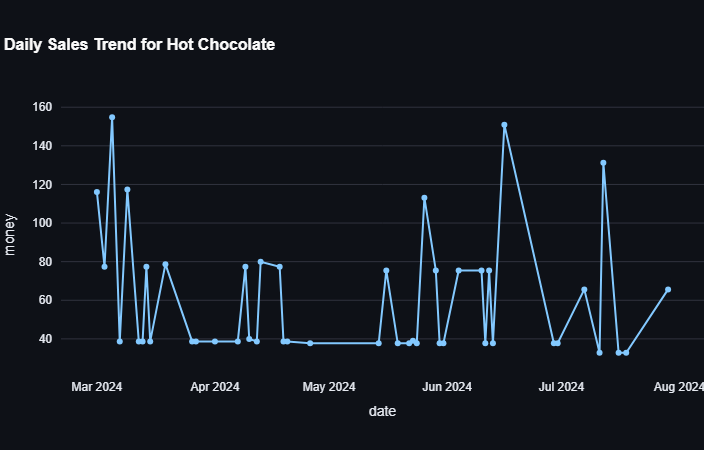

# ☕ Coffee Sales Analysis Dashboard

This project is a complete end-to-end data science solution for analyzing coffee shop sales data.  
It covers **data cleaning**, **exploratory data analysis (EDA)**, **forecasting**, **automated report generation**, and an interactive **Streamlit dashboard** — fully deployed for live access.

---

## 📊 Project Overview

Coffee shops generate large volumes of transactional data daily. This project demonstrates how to turn raw sales data into actionable insights for better decision-making.

**Key objectives:**
- Clean and process raw coffee sales data.
- Explore data through detailed EDA.
- Visualize sales trends and patterns.
- Forecast future sales using Prophet.
- Generate automated PDF, DOCX, and PPTX reports.
- Deploy a live interactive dashboard.

---

## ✅ Features

- 📈 Visualize sales by product, time period, and payment method.
- 🧾 Understand customer trends and seasonal patterns.
- 🔮 Forecast future sales with time series models.
- 📑 Export custom reports (PDF, Word, PPT).
- 🌐 Live interactive dashboard built with Streamlit.

---

## 🚀 Live Dashboard

👉 [**View the Coffee Sales Dashboard here**](https://coffee-sales-analysis-ve6uuxg28j4oatkq37cie3.streamlit.app/)

> ℹ️ Note: The link may take a few seconds to load if the server is sleeping.

---

## 🖼️ Dashboard Preview

Below is a static preview of the deployed dashboard:



> 📌 This is a static preview — [click here](https://coffee-sales-analysis-ve6uuxg28j4oatkq37cie3.streamlit.app/) to try it live!

---
---

## 📌 Project Findings & Insights

**1️⃣ Data Cleaning & Preparation**  
- Parsed all `datetime` values.  
- Verified `money` column as sales amount.  
- Added missing `hour` and `weekday` columns as needed.

**2️⃣ Exploratory Data Analysis (EDA)**  
- Visualized sales trends by weekday and hour using a clear Seaborn heatmap.  
- Found peak sales hours in mornings and early afternoons.  
- Noted that weekdays show stronger sales volume than weekends.

**3️⃣ Forecasting**  
- Built a Prophet model on daily total sales (`money`).  
- Forecasted the next 30 days — stable upward trend with clear seasonal patterns.  
- Forecast helps plan inventory, promotions, and staffing.

**4️⃣ Deliverables**  
- Clean dataset, EDA visuals, heatmaps, Prophet forecast plots.  
- Automated PDF, DOCX, and PPTX reports.  
- Deployed live dashboard: [**Click here**](https://coffee-sales-analysis-ve6uuxg28j4oatkq37cie3.streamlit.app/)

**5️⃣ Suggested Actions**  
- Focus promotions on peak hours.  
- Use forecast to manage stock and schedules.  
- Analyze card vs cash payment trends to improve services.  
- Expand dashboard with product-level drilldowns.

**Key Insight:**  
Your coffee shop’s sales show clear daily and hourly trends — plus the forecast empowers data-driven planning for sustained growth.

---
## 📂 Project Structure

```plaintext
coffee-sales-analysis/
│
├── dashboard/
│   └── coffee_dash_app.py     # Streamlit app source
│
├── data/
│   └── index.csv              # Coffee sales dataset
│
├── reports/
│   └── Generated PDF/DOCX/PPTX report
```
## ⚙️ Tech Stack

- **Python 3**
- **Pandas** – data manipulation
- **Plotly**, **Plotly Express** – visualizations
- **Streamlit** – interactive dashboard
- **Prophet** – time series forecasting
- **FPDF2**, **python-docx**, **python-pptx** – automated reporting
- **Render.com** or **Streamlit Community Cloud** – deployment
---

## ✨ Author

**Ambrose Henry**  
📫 [GitHub](https://github.com/IamAmbrose)

---

## 📜 License

This project is licensed under the **MIT License**.  
See the [LICENSE](LICENSE) file for details.
